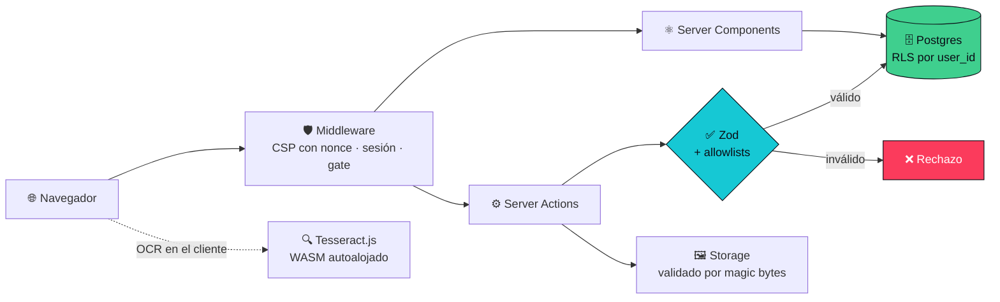

<div align="center">

# ⚔️ Smite 2 Tracker

**Estadísticas personales de Smite 2 extraídas de tus propias capturas de pantalla.**
Sin API oficial: el marcador se lee por OCR y se convierte en winrate, builds y matchups.

[](https://nextjs.org)
[](https://react.dev)
[](https://typescriptlang.org)
[](https://tailwindcss.com)
[](https://supabase.com)
[](https://zod.dev)

[](https://threejs.org)
[](https://tesseract.projectnaptha.com)
[](https://recharts.org)
[](https://motion.dev)

</div>

---

## 🎯 Qué resuelve

Smite 2 **no tiene API pública** para terceros, así que no hay forma de descargar tu historial de partidas. Este proyecto lo suple leyendo la captura del marcador final:

```
📸 Captura del marcador  →  🔍 OCR + coincidencia difusa  →  🗄️ Postgres  →  📊 Winrate · Builds · Matchups
```

El reconocimiento de dioses combina **OCR de texto** con **distancia de Levenshtein** y una tabla de alias en castellano (`JANO → janus`, `QUIRÓN → chiron`), porque la localización española cambia los nombres respecto al catálogo interno del juego.

---

## ✨ Funcionalidades

| | Módulo | Descripción |
|---|---|---|
| 📊 | **Dashboard** | Winrate global, por dios y por rol · KDA medio y tendencia · racha actual |
| 📸 | **Escáner de partidas** | Calibración por arrastre + OCR de los 10 jugadores (dios, rol) y de tu build |
| 🧙 | **Catálogo** | 88 dioses con habilidades y escalados · 252 items con estadísticas y pasivas |
| 🛠️ | **Builds** | Items más usados **con su winrate**, agrupados por parche de juego |
| 🏆 | **Tier lists** | Editor arrastrable, publicación pública, visible sin cuenta |
| 📈 | **Steam** | Jugadores concurrentes de las últimas 24 h, agregados por hora |
| 🔴 | **Twitch** | Indicador de directo en la cabecera |

---

## 🏗️ Arquitectura



El OCR corre **íntegramente en el navegador** (WASM autoalojado, sin CDN): las capturas nunca salen del dispositivo salvo que el usuario decida guardarlas.

---

## 🔐 Seguridad

<details>
<summary><b>Modelo de amenazas y decisiones — desplegar</b></summary>

<br>

**Inyección SQL.** Todo el acceso pasa por supabase-js/PostgREST, que envía los valores como parámetros vinculados. **Cero SQL concatenado, cero `.rpc()`.** No se filtran comillas a propósito: sería inútil como defensa y corrompería datos legítimos (`Chang'e`, `O'Brien`).

**XSS.** React escapa toda interpolación y el proyecto no usa `dangerouslySetInnerHTML` en ningún punto. El único valor que llega a un `style` en línea de una página pública (el color de un tier) está restringido a hexadecimal por expresión regular.

**Caracteres invisibles.** El escapado de React cubre la sintaxis de marcado, pero deja pasar los codepoints invisibles. En los campos públicos (título y autor de una tier list) se eliminan los de anchura cero y los de anulación bidireccional (`U+202A`–`U+202E`), que permitirían suplantar el nombre de otro autor o reordenar el texto mostrado (*Trojan Source*). La longitud se mide **después** de limpiar.

**Subida de ficheros.** El tipo se deduce de los **bytes de cabecera**, no del `Content-Type` que declara el navegador — que es dato del cliente y antes decidía tanto la extensión guardada como el tipo con el que se volvía a servir. SVG queda excluido por ser el único formato de imagen que además ejecuta scripts. El nombre original nunca se usa: la ruta es `<user_id>/<uuid>.<ext>`.

**Enumeración de cuentas.** El inicio de sesión nunca distingue «no existe esa cuenta» de «contraseña incorrecta», y la recuperación responde idéntico exista o no el correo (OWASP ASVS 2.2). Verificado contra la API real.

**Contraseñas.** Mínimo 8 caracteres, máximo **72 bytes** (bcrypt trunca ahí en silencio), lista de contraseñas comunes en castellano e inglés, y **sin reglas de composición** — ASVS las desaconseja porque empujan a `Password1!`.

**Cabeceras.** CSP con nonce generado por petición en el middleware, de forma que `script-src` no necesita `unsafe-inline` (los estilos sí lo llevan, por las propiedades en línea que genera Tailwind). Además HSTS, `X-Frame-Options: DENY`, `X-Content-Type-Options: nosniff`, `Referrer-Policy` y `Permissions-Policy`.

**Aislamiento de datos.** Row Level Security por `user_id` en todas las tablas privadas, más `GRANT` explícitos por rol. `user_id` se toma siempre de la sesión verificada en servidor, nunca del formulario.

</details>

<details>
<summary><b>Acceso público vs. privado</b></summary>

<br>

| Ruta | Sin cuenta (escritorio) | Sin cuenta (móvil) |
|---|:---:|:---:|
| `/gods` `/items` `/faq` `/tierlist` | ✅ | 🔒 |
| `/login` `/auth/confirm` `/cuenta/contrasena` | ✅ | ✅ |
| `/` `/partidas` `/builds` `/matches/new` | 🔒 | 🔒 |

> ⚠️ La restricción móvil es una **regla de producto, no una barrera de seguridad**: se basa en `Sec-CH-UA-Mobile` y el `User-Agent`, ambos falsificables. El aislamiento real lo proporciona RLS, en todos los dispositivos por igual. Nótese que gatear el móvil **excluye las páginas públicas del índice de Google**, que rastrea con agente móvil.

</details>

---

## ♿ Accesibilidad

- **Enlace de salto** al contenido en todas las páginas (WCAG 2.4.1) — evita tabular por la cabecera entera en cada navegación.
- **Combobox ARIA 1.2** en el buscador de dioses, con flechas, `Enter`, `Escape` y `aria-live`. Antes los resultados solo se podían elegir con ratón.
- **Nombres accesibles** en todo control sin texto visible, incluidos los 20 desplegables del revisor del escáner, desambiguados por fila.
- `aria-current="page"`, landmarks nombrados, `role="alert"` en los errores de autenticación.
- **`prefers-reduced-motion`** respetado, con un interruptor para activar las animaciones voluntariamente: un ajuste del sistema es un valor por defecto, no un veto.

> 🧩 **Regla aprendida a base de fallos:** ninguna animación decide si el contenido existe. `AnimatePresence mode="wait"` retenía el formulario de registro indefinidamente cuando la animación de salida no llegaba a ejecutarse — con *reducir movimiento* activado, **nadie podía registrarse**.

---

## 🚀 Puesta en marcha

<details open>
<summary><b>Instalación</b></summary>

<br>

**1. Crear el proyecto en Supabase** ([supabase.com](https://supabase.com), el plan gratuito basta).

**2. Ejecutar las migraciones** en el SQL Editor, **en orden**, de `0001` a `0011`:

```bash
supabase/migrations/0001_init.sql → 0011_gods_anon_grants.sql
```

**3. Configurar el entorno** — copia `.env.example` a `.env.local`:

```bash
cp .env.example .env.local
```

| Variable | Ámbito | Uso |
|---|---|---|
| `NEXT_PUBLIC_SUPABASE_URL` | 🌐 público | Endpoint del proyecto |
| `NEXT_PUBLIC_SUPABASE_ANON_KEY` | 🌐 público | Clave anónima (protegida por RLS) |
| `SUPABASE_SERVICE_ROLE_KEY` | 🔒 **servidor** | Solo los scripts de sembrado |
| `TWITCH_CLIENT_ID` / `TWITCH_CLIENT_SECRET` | 🔒 **servidor** | Indicador de directo (opcional) |

**4. Sembrar el catálogo y arrancar:**

```bash
npm install
npm run seed:gods                  # los 88 dioses de una vez
npm run seed:abilities -- apollo   # habilidades, un dios por invocación
npm run dev
```

> Las habilidades se siembran **bajo demanda, dios a dios**: raspar los 88 por adelantado no compensa para los que nadie consulta. Una ficha sin habilidades sembradas se renderiza igual, solo que sin esa sección.

</details>

<details>
<summary><b>Plantillas de correo de Supabase</b></summary>

<br>

En **Authentication → Email Templates**, usa `{{ .TokenHash }}` en lugar de `{{ .ConfirmationURL }}`:

```
{{ .SiteURL }}/auth/confirm?token_hash={{ .TokenHash }}&type=recovery
```

El flujo PKCE guarda su verificador en una cookie del dispositivo que **inició** la petición: si alguien pide el restablecimiento en el ordenador y abre el correo en el móvil, el canje falla. `verifyOtp` no tiene esa limitación. La aplicación admite ambos formatos, pero este es el recomendado.

</details>

---

## 🧪 Verificación

```bash
npm run check       # 60 comprobaciones automatizadas
npm run typecheck   # tsc --noEmit
npm run lint
```

| Script | Comprobaciones | Cubre |
|---|:---:|---|
| `check-sanitize` | 8 | Allowlists, caracteres invisibles y bidi, apóstrofos legítimos |
| `check-image-sniff` | 6 | SVG y HTML disfrazados de PNG |
| `check-auth-errors` | 13 | Mapeo de errores, garantía de no enumeración |
| `check-password-policy` | 17 | Política OWASP, límite de 72 **bytes**, medidor |
| `check-safe-next` | 16 | Redirección abierta en el enlace de correo |

---

## 📁 Estructura

```
src/
├── app/
│   ├── (app)/          # Rutas con cabecera: dashboard, partidas, builds, catálogo
│   ├── auth/confirm/   # Canje del token emailado → sesión
│   ├── cuenta/         # Cambio de contraseña
│   └── login/          # Entrar · registro · recuperación
├── components/
│   ├── match-form/     # Escáner OCR y calibración
│   ├── tierlist/       # Editor y visor
│   └── three/          # Fondo WebGL (shader, 1 draw call)
├── lib/
│   ├── validation/     # Esquemas Zod, saneado, política de contraseñas
│   ├── supabase/       # Clientes servidor/navegador/middleware
│   └── god-name-match  # OCR + Levenshtein + alias en castellano
└── data/               # Catálogos: 88 dioses · 252 items
supabase/migrations/    # 11 migraciones SQL versionadas
scripts/                # Sembrado y verificación
```

---

## 📋 Decisiones técnicas

<details>
<summary><b>Por qué OCR de texto en lugar de hashing perceptual</b></summary>

<br>

La primera versión identificaba dioses por **dHash** de su retrato. Fallaba de forma sistemática: el arte de los retratos es muy detallado y un hash de 64 bits sobre imágenes así es una señal frágil.

La causa de fondo resultó ser otra: el worker de OCR tenía una **lista blanca de solo dígitos**, así que jamás pudo leer un nombre. Corregido eso y añadiendo coincidencia difusa con alias en castellano, el reconocimiento pasó a **10 de 10** sobre una captura real. El hash quedó como respaldo cuando el nombre resulta ilegible.

</details>

<details>
<summary><b>Por qué los catálogos son JSON y no consultas</b></summary>

<br>

`gods.json` es la **fuente de la verdad**: `scripts/seed-gods.ts` lo carga en la tabla `gods`. Leer la tabla desde las páginas de catálogo era leer una copia del fichero que ya se distribuye con la aplicación — con un viaje de red y una dependencia de permisos por medio. La tabla sigue existiendo como destino de la clave foránea `matches.god_id`.

</details>

<details>
<summary><b>Por qué RLS no basta sin GRANT</b></summary>

<br>

Postgres evalúa **dos capas independientes**: los privilegios (`GRANT`) y luego las políticas de fila (RLS). El privilegio se comprueba primero. Una tabla con políticas impecables pero sin `GRANT` rechaza a todo el mundo, incluido el dueño de las filas — y como el error viaja dentro de la respuesta, la página renderiza cero resultados en lugar de fallar de forma visible. Las migraciones `0008` y `0011` existen precisamente para reparar esa omisión.

</details>

---

<div align="center">

**Proyecto personal** · Datos de dioses e items obtenidos de [SmiteSource](https://smitesource.com) y [wiki.smite2.com](https://wiki.smite2.com)
Smite 2 es propiedad de Hi-Rez Studios. Este proyecto no está afiliado a Hi-Rez.

</div>
